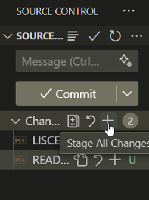
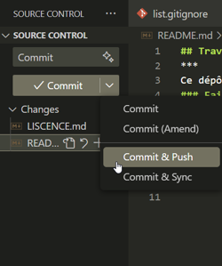

## Visual Studio Code
***
Ce dépôt contient le code d'un projet web fait dans le cours de Perspectives Professionnelles
### Faire un *commit* et un *push* dans *Visual Studio Code*
***
Voici comment faire un changement sur ce projet, et l'envoyer sur GitHub
1. Cloner le depot GitHub à partir de *Visual Studio Code*
2. Dans *Source Control* cliquez sur *Stage All Changes* 
3. Écrivez un message de *commit* et appuyez sur le bouton *commit*
4. Appuyez sur *push* pour synchronizer avec GitHub

#### Contributeurs
***
- Kit Hudon - Auteur Principal
#### Licence
***
Copyright @ 2023 Kit Hudon. Tous droits réservés.